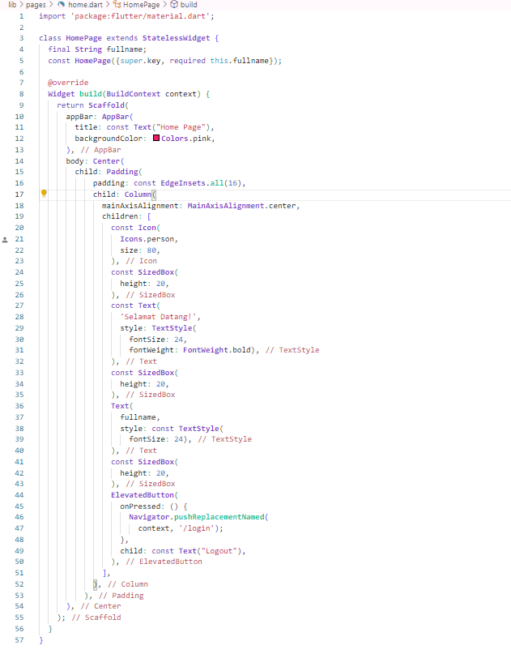

1.Membuat folder dengan nama project_uts_mona

2.Membuat folder di lib dengan nama models dan pages
lalu membuat file dengan nama user.dart di folder models, membuat file home.dart,login.dart,register.dart dan main.dart

3.Lalu mengisi file user.dart
Kelas ini berfungsi sebagai model atau blueprint untuk membuat objek User, yang kemungkinan besar mewakili pengguna dalam aplikasi.

4.Mengisi file home.dart
Kelas HomePage adalah stateless widget. Stateless widget digunakan saat UI tetap sama setelah diinisialisasi, dan karena data fullname hanya diteruskan dari luar tanpa perubahan apapun, penggunaan StatelessWidget sudah benar. Properti fullname adalah properti dengan tipe data String, parameter ini wajib diisi, agar halaman dapat menampilkan nama lengkap pengguna yang diteruskan saat halaman ini dipanggil.

5.mengisi file login.dart
class LoginPage:LoginPage adalah StatefulWidget yang memungkinkan halaman ini berinteraksi dan memperbarui UI berdasarkan input pengguna (state).
_LoginPageState menangani logika login, validasi, dan navigasi.
Form Input:Email: Menggunakan TextFormField dengan validasi untuk memastikan email diisi dan dalam format yang benar (menggunakan MultiValidator).
Password: Input untuk password menggunakan properti obscureText agar teks disembunyikan, dengan validasi agar password tidak kosong.
Validasi Login:Ketika tombol "Login" ditekan, form akan divalidasi menggunakan _formKey.
Data yang dimasukkan dibandingkan dengan daftar pengguna terdaftar (registeredUsers).
Jika kredensial benar, pengguna diarahkan ke halaman HomePage dengan nama lengkap yang sesuai.
Jika salah, ditampilkan pesan error menggunakan SnackBar.Tombol Navigasi Registrasi:Ada tombol TextButton yang memungkinkan pengguna untuk berpindah ke halaman registrasi jika mereka belum memiliki akun.

6.mengisi register.dart
Program ini menangani registrasi pengguna dengan validasi form yang memadai. Setelah berhasil mendaftarkan diri, pengguna diarahkan ke halaman login.

main.dart
Program ini mengatur halaman utama aplikasi sebagai halaman Login dengan navigasi yang sudah ditentukan ke halaman Register melalui routes. Struktur program sederhana dan menggunakan MaterialApp untuk tema dan navigasi layar.

lalu jalankan(run) hasil program yang sudah di buat sambil mencoba login dan register

 
 selesai

